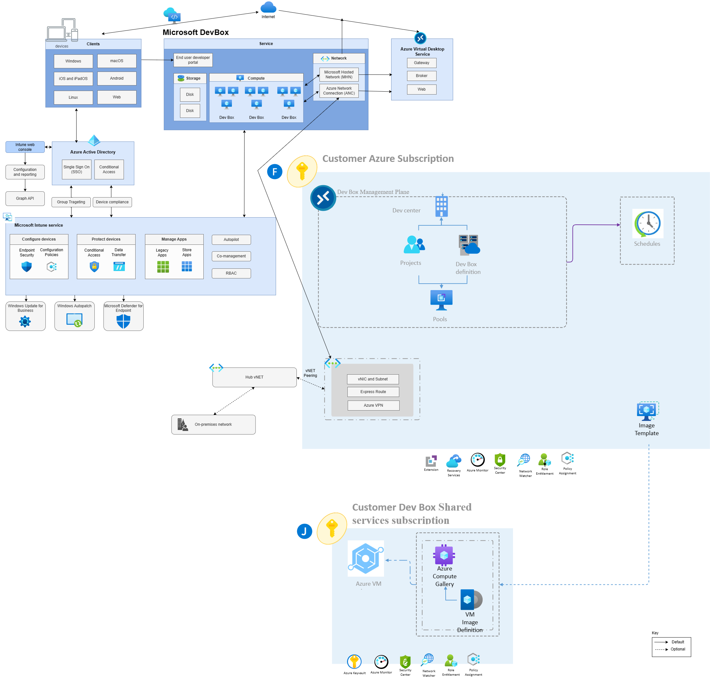

# Dev Box Overview

## Streamlining Developer Onboarding with Microsoft Dev Box
In the realm of software development, bringing new developers up to speed with a codebase can often be a lengthy process. It’s not uncommon for it to take several days or even weeks for a developer to reach the point where they can effectively build and debug their code. This is a challenge that Microsoft Dev Box aims to address.

## What is Microsoft Dev Box?
Microsoft Dev Box is a platform designed to expedite the onboarding process for developers. It empowers developers with the ability to control and create their own workstations, start and stop those workstations, and even hibernate and create new ones.

Teams are given the autonomy to define what goes into a workstation and which connections are used. Meanwhile, IT departments can set and define central policies, network connections, and ensure all policies from Intune pass through onto the dev boxes.

## Customization at its Core
One of the key features of Dev Box is its ability to be customized. A dev lead configures a code file, checks it into source control, and then the dev team can maintain their customizations by adding onto this file. This allows the pre-configured environment to evolve over time with the project rather than maintaining countless baked-in images.

## Flexibility and Control
With Dev Box, developers are afforded tremendous flexibility. They can self-serve, scale up or down these workstations instantly by setting a new skew within the service, isolate work, secure environments by only providing the resources or endpoints that they need access to. They can even start to onboard vendor teams and contractors through the same tools and resources your dev teams use.

## Architecture, Roles & Responsibilities and Implementation

One observation that you may realise with the architecture above, is the Azure Dev Boxes workstations are actually run on a Microsoft-managed subscription (the benefit of being SaaS vs. PaaS) and these same workstations are able to speak to resources in your own Azure subscriptions through the magic of vnet injection (connecting up your Dev Box vNET hosted in your subscription over to the workstations hosted in the Microsoft-managed subscription). As well as protecting your resources with AAD/Entra, you can also protect which privated endpoints can be accessed by creating different Dev Box vNETs. A Dev vNET and [project](https://learn.microsoft.com/en-us/azure/dev-box/concept-dev-box-concepts#project) has a 1:many mapping, which means different projects can be hooked up to different virtual networks that has different routing rules to limit down what resources the project(s) should have access to.

## Roles and responsibilities

## Deployment:- IaaC Accelerator and Portal deployments

You can get started today using the Microsoft Dev Box IaaC Accelerator using Bicep [here](https://github.com/Azure-Samples/Devcenter). The sample also paints a clear picture of the dependencies and relationship between the difference Dev Box components.

Alternatively, you can deploy Dev Box using the Azure portal using the step-by-step instructions located [here](https://learn.microsoft.com/en-us/azure/dev-box/quickstart-configure-dev-box-service?tabs=AzureADJoin).

# Additional resources
[Key concepts for Microsoft Dev Box](https://learn.microsoft.com/en-us/azure/dev-box/concept-dev-box-concepts)

[Demo of Microsoft Dev Box](https://www.youtube.com/watch?v=D5RV-caTHLA)

