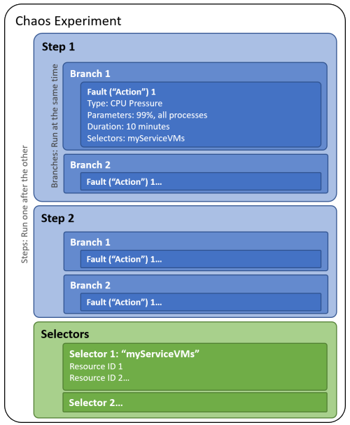
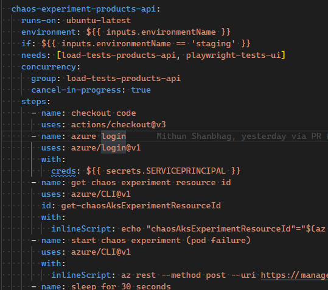

# Chaos Engineering Overview

## What is Chaos Engineering
As part of your testing and CI strategy, you may want to cause some chaos: one of the key engineering concepts is to plan for the worst-case scenario, and this is what we want to do, specially when talking about highly available and mission critical applications. 

Chaos Engineering consists in making parts of our solution fail in a controlled manner so that we can plan and architect in a robust way to anticipate to any issues, such as outages. For example, we might want to test as part of our CI pipeline that the change we're introducing meets our highly available requirements for our HA/mission critical service: if an availability zone goes down, our solution needs to work regardless, and we must be sure it works before reaching production for best practices and shifting left purposes. Additionally, you can shift right to work with real customer traffic or simulated load, allowing you to recreate real past issues. This can be done and enhanced by pairing it with Azure Load Testing.

And for these, we will use Azure Chaos Studio, which allows us to configure these experiments with very little complexity.

## Azure Chaos Studio in a nutshell (WIP)
[Azure Chaos Studio](https://learn.microsoft.com/en-US/azure/chaos-studio/chaos-studio-overview) is managed Azure service that allows you create straightforward chaos engineering experiments by abstracting all the complexity. This service is relatively new and continues growing in capabilities, so make sure to check for updates. For additional usecases, follow this [link](https://learn.microsoft.com/en-us/azure/chaos-studio/chaos-studio-overview#chaos-studio-scenarios).

## Create and implement Chaos Experiments
Experiments are very straightforward to create and they are relatively similar to CI/CD pipelines, Power Automate or Azure Logic Apps, regarding the logic.

The first thing to do before creating an experiment is enabling the targets, which is done directly from Azure Chaos Studio. The reason behind it, is that we don't want to allow everyone to make any service fail, because these faults introduced are real faults, so **never target production instances**. We can use RBAC to control it.



Steps run sequentially and branches run in parallel. You can use this to build your desired logic and the kinds of faults will depend on the scenario and targets, each with different options and configurations. 

You can also create these experiments as part of your [Bicep IaC](https://learn.microsoft.com/en-us/azure/chaos-studio/chaos-studio-bicep?tabs=CLI) or via its [REST API](https://learn.microsoft.com/en-us/azure/chaos-studio/chaos-studio-samples-rest-api).

Once your experiment is ready, you can trigger it directly from the portal and see the impact. But let's see how we can apply it to our DevOps lifecycle.

## Run experiments as part of your CI/CD pipelines
As we were introducing at the beginning of the page, we want to include Chaos Experiments as part of our DevOps practices. They can be used in production-like environments to test the robustness of our solution by triggering faults and checking that the state of our service is as expected, even when things go south or when we anticipate some major disruption.

At the moment of writing this page there are no specific GitHub Actions or ADO Tasks to trigger them, but as with any Azure resource, we can do this via an [API call](https://learn.microsoft.com/en-us/azure/chaos-studio/chaos-studio-samples-rest-api#start-an-experiment) as part of our pipeline.

```azurecli
az rest --method post --url "https://management.azure.com/{experimentId}/start?api-version={apiVersion}"
```
Then, we can use Azure Monitor or similar and related services like Application Insights to monitor the impact and retrieve specific data.

### Tips for using the API via Azure CLI
|Parameter name|Location|Format|
|--|--|--|
|experimentId|Navigate to Azure Portal > Chaos Studio > Experiments > {your experiment} > JSON View: `id` parameter| /subscriptions/`subscriptionId`/resourceGroups/`rgName`/ providers/Microsoft.Chaos/experiments/`experimentName`|
|apiVersion|Navigate to Azure Portal > Chaos Studio > Experiments > {your experiment} > JSON View: top right corner| {yyyy}-{mm}-{dd}(-preview)|
|execucionDetailsId|Navigate to Azure Portal > Chaos Studio > Experiments > {your experiment} > Overview: History: Identifier (make sure to double click as the ID is only partially visible)|*3C5F1BD4-8DC0-4035-A8BB-FDC6215D7FD9*|


|t1|t2|
|--|--|
|a|b|

## Demo
To learn and/or to demo it, you can use the end-to-end scenario created on [this GitHub repository](https://github.com/microsoft/contosotraders-cloudtesting/tree/main). It includes the necessary IaC to deploy all the resources and the guidance to run through it. It is specifically recommended to check out the [Chaos Studio folder](https://github.com/microsoft/contosotraders-cloudtesting/blob/main/demo-scripts/azure-chaos-studio/walkthrough.md), specifically this [walk through section for running chaos experiments with GitHub actions](https://github.com/microsoft/contosotraders-cloudtesting/blob/main/demo-scripts/azure-chaos-studio/walkthrough.md#walkthrough-running-chaos-experiments-via-github-workflows).

At the end, you should be able to run the experiment via a GitHub Actions workflow as seen on the picture below:


