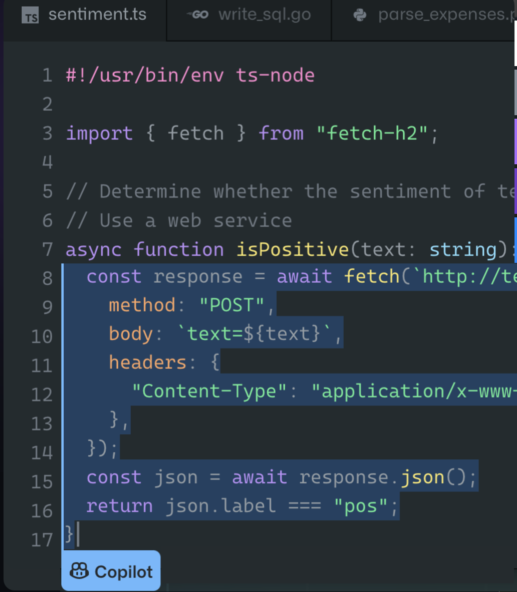

# GitHub Copilot for Business

## Overview

GitHub Copilot is a new AI-powered tool that helps developers write code faster and better. It is a product of a collaboration between GitHub and OpenAI, using deep learning models trained on billions of lines of code. Here are some of the key features of GitHub Copilot:

- **Autocompletion**: GitHub Copilot can predict the next line or chunk of code based on the context and the user's intent. It can also suggest alternative ways to write the same code, allowing the user to choose the best option.
- **Code generation**: GitHub Copilot can turn natural language comments into executable code, saving the user time and effort. For example, the user can write "sort the list in descending order" and GitHub Copilot will generate the corresponding code in the chosen language.
- **Multi-language support**: GitHub Copilot can understand and assist in many programming languages, such as Python, JavaScript, Ruby, Go, Java, and more. It can also help the user learn new languages or frameworks by providing relevant examples and documentation.
- **Inline documentation**: GitHub Copilot can provide explanations and best practices for the suggested code snippets, helping the user understand their code better and improve their coding skills. It can also generate unit tests, comments, and docstrings for the user's methods and functions.

GitHub Copilot is designed to be a helpful companion for developers of all levels, whether they are working on a personal project, a professional assignment, or a learning challenge. It is not meant to replace human programmers, but rather to augment their capabilities and creativity. GitHub Copilot is currently available as a technical preview for Visual Studio Code users who sign up for early access .

GitHub Copilot is a collaboration between GitHub and OpenAI, and it integrates with popular IDEs such as Visual Studio Code, Visual Studio, Neovim, and JetBrains. As it's on the IDE, it doesn't have to be linked to GitHub repositories and can work on any code that's been opened in the IDE.

It's key to note that GitHub Copilot is just that, it's a Copilot and not the Pilot. It can help with a number of tasks that developers need to perform. But it's still up to the developer to be the Pilot and make the decisions on the code suggestions from Copilot. 

---

## Getting started with GitHub Copilot

After enabling GitHub Copilot in your IDE, you can start using it to get suggestions for your code. You can trigger suggestions by typing a comment, a partial line of code, or pressing Ctrl+Enter. You can cycle through different suggestions by pressing Tab or Shift+Tab. You can accept a suggestion by pressing Enter or clicking on it.

For more information on how to use GitHub Copilot in different scenarios, see [Getting started with GitHub Copilot](https://docs.github.com/en/copilot/getting-started-with-github-copilot).

---

## GitHub Copilot



Offers code suggestions contextualized to your project. Allows  developers to work with copilot as part of their day job.

Below shows some of the features:

- **Convert comments to code**: Trained on billions of lines of code it turns natural language prompts into coding suggestions
- **Autofill for repetitive code**: Spend less time creating boilerplate and repetitive code patterns, and more time on what matters: building great software
- **Show alternatives**: Quickly cycle through lines of code, complete function suggestions, and decide which to accept, reject, or edit.

---

## GitHub Copilot for Business Chat


GitHub Copilot for Business Chat is a new feature that lets you chat with GitHub Copilot, an AI-powered coding assistant, directly from your IDE. Whether you need help with syntax, concepts, test cases, debugging, or anything else related to coding, GitHub Copilot for Business Chat can provide you with relevant answers and suggestions in natural language. You can also ask GitHub Copilot to generate code snippets for you based on your specifications.

GitHub Copilot for Business Chat is currently available in Visual Studio Code and Visual Studio, and supports a wide range of programming languages and frameworks. GitHub Copilot for Business Chat is designed to help you code faster, smarter, and easier, without leaving your IDE. It is also constantly learning from your feedback and improving its performance over time.

To get started with GitHub Copilot for Business Chat, you need a GitHub Copilot for Business subscription, which gives you access to the public beta of this feature. You can learn more about GitHub Copilot for Business Chat and how to use it from the official documentation.

Below are some of the feature:

- **Rewrite code into other languages**: Can look to rewrite from one language to another. Help with migrations and modernization. (E.g. Legacy PHP program to C#,  IaC Terraform to Bicep , Bash script to PowerShell.) 
- **Refactor and Optimize code**: Look at the code and suggest ways and examples to improve and optimize it. 
- **Fix Errors, Bugs  and Logic Issues**: Offer suggestions to fix issues with the code. From missing dependencies/libraires to syntax and issues with the logic.
- **Document and Describe Code**: Look at the code and describe it and what it does. Add comments to it. Good for documentation and new people needing to work with it. Can help with situations where the developer has left and somebody else needs to maintain the code.
- **Fix Security and Vulnerability Issues**: Improve security posture of the code. Example could identify SQL Injection issues and suggest solutions.

---

# How to purchase and enable GitHub Copilot for developers

To use GitHub Copilot, you need a GitHub account and a compatible IDE. You also need a GitHub Copilot subscription, which you can purchase for your personal account or your organization account.

## For personal accounts

If you want to purchase GitHub Copilot for your personal account, you can choose between a monthly or a yearly plan. There's a monthly and yearly plan for pricing with details [here](https://docs.github.com/en/enterprise-cloud@latest/copilot/overview-of-github-copilot/about-github-copilot-for-individuals). You can also try GitHub Copilot for free with a one-time 30-day trial. If you are a verified student, teacher, or maintainer of a popular open source project, you can use GitHub Copilot for free.

To purchase or start a trial of GitHub Copilot for your personal account, follow these steps:
```
1. In the upper-right corner of any page, click your profile photo, then click Settings.
2. In the "Code, planning, and automation" section of the sidebar, click GitHub Copilot.
3. On the GitHub Copilot settings page, click Enable GitHub Copilot.
4. Choose whether you want to pay monthly or yearly, and click Continue to get access to Copilot.
5. Follow the steps to confirm your payment details, then click Submit.
```
## For organization accounts

If you want to purchase GitHub Copilot for your organization account, you need a GitHub Copilot for Business subscription. GitHub Copilot for Business offers enterprise-grade security, privacy, compliance, and responsible AI features. You can purchase GitHub Copilot for Business for an organization or an enterprise, can be found [here](https://docs.github.com/en/enterprise-cloud@latest/copilot/overview-of-github-copilot/about-github-copilot-for-business).

To purchase GitHub Copilot for Business for an organization, follow these steps:
```
1. Go to the GitHub Copilot for Business sign up page.
2. Select an organization for which you want to purchase GitHub Copilot and click Continue.
3. Follow the steps to confirm your payment details, then click Save.
```
To purchase GitHub Copilot for Business for an enterprise, follow these steps:
```
1. Go to the GitHub Copilot for Business sign up page.
2. To purchase GitHub Copilot for your enterprise, select Enable GitHub Copilot at an enterprise level and click Continue.
3. Select the enterprise for which you want to purchase GitHub Copilot and click Continue.
4. Follow the steps to confirm your payment details, then click Save.
```
After purchasing GitHub Copilot for Business for your organization or enterprise, you can assign seats to members who can use GitHub Copilot.

---

## Enabling GitHub Copilot in your IDE

After purchasing or starting a trial of GitHub Copilot for your account, you can enable it in your IDE by installing the GitHub Copilot and GitHub Copilot Chat extensions. The extensions are available for Visual Studio Code, Visual Studio, Neovim, and JetBrains IDEs.

To install the extension in Visual Studio Code:
```
1. Open Visual Studio Code.
2. In the Extensions view (Ctrl+Shift+X), search for "GitHub copilot" or "GitHub Copilot Chat".
3. Click Install next to the extension name.
4. Sign in with your GitHub account when prompted.
```

To install the extension in Visual Studio:
```
1. Open Visual Studio.
2. In the Extensions menu, select Manage Extensions.
3. In the Online section of the left pane, search for "GitHub copilot" or "GitHub Copilot Chat".
4. Click Download next to the extension name.
5. Restart Visual Studio when prompted.
6. Sign in with your GitHub account when prompted.
```
To install the extension in Neovim:
```
1. Install vim-plug if you don't have it already.
2. Add `Plug 'github/copilot.vim'` to your `.vimrc` file.
3. Run `:PlugInstall` in Neovim.
4. Sign in with your GitHub account when prompted.
```
To install the extension in JetBrains IDEs:
```
1. Open any JetBrains IDE (such as IntelliJ IDEA or PyCharm).
2. In the Settings/Preferences dialog (Ctrl+Alt+S), select Plugins.
3. In the Marketplace tab of the right pane, search for "GitHub copilot" or "GitHub Copilot Chat".
4. Click Install next to the extension name.
5. Restart the IDE when prompted.
6. Sign in with your GitHub account when prompted.
```
---

## Prompt Engineering

Prompt engineering is the process of creating effective prompts that enable AI models to generate responses based on given inputs. Prompt engineering essentially means writing prompts intelligently for text-based Artificial Intelligence tasks, more specifically, Natural Language Processing (NLP) tasks³.

To get the best out of GitHub Copilot, you need to master the art of prompt engineering. Here are some tips and best practices for designing prompts that produce the desired outputs:

- Use natural language comments to describe what you want the code to do. For example, `// Sort the array in ascending order` or `// Return the sum of two numbers`.
- Use specific and varied examples to help the model narrow its focus and generate more accurate results. For example, `// Example: [3, 1, 4, 2] -> [1, 2, 3, 4]` or `// Example: sum(2, 3) -> 5`.
- Use constraints to limit the scope of the model's output. This can help avoid meandering away from the instructions into factual inaccuracies. For example, `// Limit your response to 10 lines of code` or `// Do not use any external libraries`.
- Break down complex tasks into a sequence of simpler prompts. For example, instead of asking for a complete web app, ask for individual components like `// Create a login form` or `// Connect to a database`.
- Instruct the model to evaluate or check its own responses before producing them. For example, `// Make sure to handle edge cases` or `// Test your code with different inputs`.

[What is prompt engineering](https://www.geeksforgeeks.org/what-is-prompt-engineering-the-ai-revolution/) is a good link to more information on this.

---

## Benefits for different Persona's 

- **Early in Career / New Developers**
  - Help Accelerate learning
  - Get hands-on quicker
  - Build confidence
  - Improve quality

- **Lead / Senior Developers**
  - Unit Tests
  - Comments code
  - Describing and documentation code
  - Vulnerability and security checks

- **Other (Infra, Data) engineers**
  - Enables to quickly code scripts supporting Infrastructure and data
  - Examples:
    - Bash and PowerShell scripts
    - IaC working with Terraform, ARM and Bicep.
    - Automation
    
- **Architects**
  - Helps with creating POC’s, as generally don’t write code often.

---

## Software Developenment Life Cycle (SDLC)

GitHub Copilot can be used across the SDLC and below shows this:


---

## Extra Links

[GitHub Copilot Trust Center](https://resources.github.com/copilot-trust-center/)

[How to use GitHub Copilot: Prompts, tips, and use cases](https://github.blog/2023-06-20-how-to-write-better-prompts-for-github-copilot/)

[GitHub Next](https://githubnext.com/)

[The GitHub Blog](https://github.blog/?s=copilot)

[GitHub Copilot · Your AI pair programmer](https://github.com/features/copilot)

---
