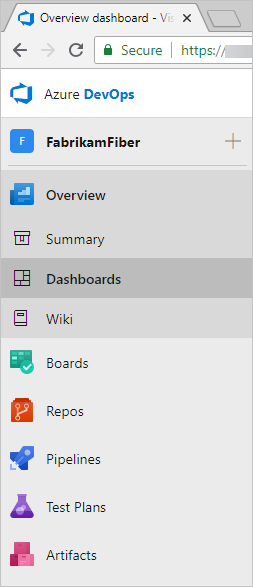

# Azure DevOps Setup and Operating Model

Azure DevOps (ADO) has a number of different services that need to be considered when setting up the service and the operational model to support the use and adoption by teams. It's key to look at the structure of an organization to best align this model for supporting growth and usability moving forward.

This guide is prescriptive in providing a way to get started with a view to scale moving forward.

Azure DevOps consists of a number of different structures and products that need to be considered where setting up the service.

I few key products are:

Links:

- [Azure DevOps Documentation](https://docs.microsoft.com/en-us/azure/devops)  